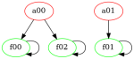
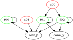
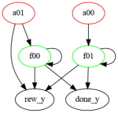
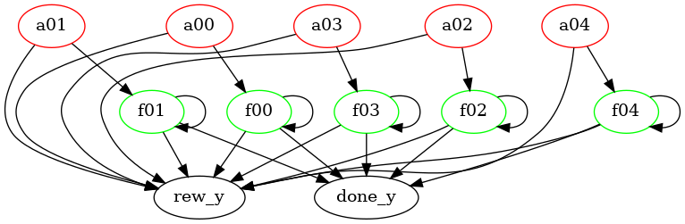
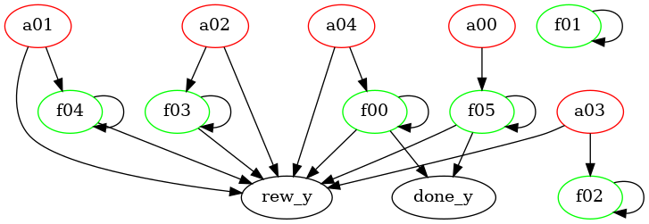
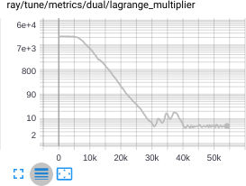
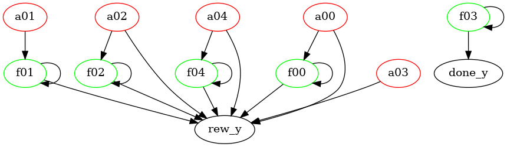

## Learning Interpretable Abstract Representations in Reinforcement Learning via Model Sparsity

The problem of learning good abstractions is arguably one of the cornerstones of Artificial Intelligence. One of the theoretical or philosophical approaches to learn abstract representations is the Consciousness Prior proposed by Yoshua Bengio. One of the key components in that project is the sparsity of the transition model, which supposedly leads to good learned abstractions. In this project, we design a simple environment where abstractions can be learned. We propose a practical framework for learning abstractions via sparsity of the transition model. The results show that we are able to recover the correct representation. We provide theoretical formulation of the problem and the explanation of the results. We provide exciting future research directions and concrete questions in the domain of learning good abstractions.

Talk for <a href="http://mlss.tuebingen.mpg.de/2020/">MLSS 2020</a>: 

Overall idea: 

Proposed architecture: 

Original causal graph (left) and optimized causal graph (right): 

Done as a semester project at Laboratory of Computational Neuroscience at the Swiss Federal Institute of Technology in Lausanne (EPFL)
<a href="https://www.overleaf.com/read/nqgjrjbcybrp">See full project report</a>

<a href="https://www.overleaf.com/read/mmmbrrvnkffq">Master thesis report draft</a>

We use [pytorch](https://pytorch.org/) to learn the sparse model and [stable baselines](https://stable-baselines.readthedocs.io/en/master/) for RL.

### Installation
1. You will need `conda` and `pip`
2. Install requirements: `pip install -r requirements.txt`
3. Install gin_tune: `pip install -e gin_tune`
3. Set up a MongoDB database `test` on port `27017` on local machine
4. Having ray installed, run `python ray/python/ray/setup-dev.py` to patch your ray installation
4. `pip install -e .`

### Performance of envs
1. `python -m causal_util.env_performance --env KeyChest-v0 --config keychest/config/5x5.gin` 
2. `python -m causal_util.env_performance --env CartPole-v0`
3. `python -m causal_util.env_performance --env VectorIncrement-v0 --config vectorincrement/config/ve5.gin`

### Learner
`python -m sparse_causal_model_learner_rl.learner --config $(pwd)/sparse_causal_model_learner_rl/configs/test_tune.gin --config $(pwd)/vectorincrement/config/ve5.gin`

### More images

Non-convex losses during training: 

Training feedback: 

Tensorboard integration: 

KeyChest environment: 

VectorIncrement environment: 
 

## VectorIncrement with 5 components
 

     

### Sanity checks

Gumbel model on ve5 (features raw):
`python -m sparse_causal_model_learner_rl.learner --config vectorincrement/config/ve5_nonlinear.gin --config sparse_causal_model_learner_rl/configs/rec_nonlin_gnn_gumbel
 --nofail --n_gpus 0 --n_cpus 1`
 
#### New modular config with ve2
1. Only features on vectorincrement (new config)
    `python -m sparse_causal_model_learner_rl.learner --config sparse_causal_model_learner_rl/configs/rl_const_sparsity_obs_space.gin --config sparse_causal_model_learner_rl/configs/env_ve2.gin --nofail --n_gpus 1`
   After ~25 minutes (~9000 steps) gives the following graph:
   
   
2. Features + reward + done
    `python -m sparse_causal_model_learner_rl.learner --nofail --n_gpus 1 --config sparse_causal_model_learner_rl/configs/rl_const_sparsity_obs_space.gin --config sparse_causal_model_learner_rl/configs/env_ve2_with_rew_done.gin`
   After ~2 hours (45k steps) gives the following graph:
   
   
3. No decoder/encoder:
    `python -m sparse_causal_model_learner_rl.learner --config sparse_causal_model_learner_rl/configs/rl_const_sparsity_obs_space.gin --config sparse_causal_model_learner_rl/configs/env_ve2_raw_with_rew_done.gin --nofail --n_gpus 1`
   After ~45 minutes gives:
   
   
4. ve5 with no encoder:
   `python -m sparse_causal_model_learner_rl.learner --nofail --n_gpus 1 --config sparse_causal_model_learner_rl/configs/rl_const_sparsity_obs_space.gin --config sparse_causal_model_learner_rl/configs/env_ve5_raw_with_rew_done.gin`
   15 minutes (~8k steps)
   
5. ve5 with decoder/encoder
   `python -m sparse_causal_model_learner_rl.learner --nofail --n_gpus 1 --config sparse_causal_model_learner_rl/configs/rl_const_sparsity_obs_space.gin --config sparse_causal_model_learner_rl/configs/env_ve5_with_rew_done.gin`
   4 hours (25000 epochs):
   
   
5. ve5 without encoder, adaptive Lagrange sparsity:
   `python -m sparse_causal_model_learner_rl.learner --nofail --n_gpus 1 --config sparse_causal_model_learner_rl/configs/rl_const_sparsity_obs_space.gin --config sparse_causal_model_learner_rl/configs/env_ve5_raw_with_rew_done.gin --config sparse_causal_model_learner_rl/configs/with_lagrange_dual_sparsity.gin`
   2 hours (50k steps)
    
5. SparseMatrix (size 5x5, 7 elements). 3mins or ~3000 epochs, Lagrange

   `python -m sparse_causal_model_learner_rl.learner --nofail --n_gpus 1 --config sparse_causal_model_learner_rl/configs/rl_const_sparsity_obs_space.gin --config sparse_causal_model_learner_rl/configs/env_sm5_noact.gin --config sparse_causal_model_learner_rl/configs/with_lagrange_dual_sparsity.gin`
6. SparseMatrix (size 5x5, 7 elements + actions). 10mins or ~400 epochs (a single epoch contains more interations), Lagrange:
   `python sparse_causal_model_learner_rl/learner.py --nofail --n_gpus 1 --config sparse_causal_model_learner_rl/configs/rl_const_sparsity_obs_space.gin --config sparse_causal_model_learner_rl/configs/env_sm5.gin --config sparse_causal_model_learner_rl/configs/with_lagrange_dual_sparsity.gin` (replace last config with `sparse_causal_model_learner_rl/configs/with_lagrange_dual_sparsity_per_component.gin` for per-component sparsity constraints)
7. ve5 with a decoder and adaptive sparsity (45000 epochs, ~4-5 hours):
   `python sparse_causal_model_learner_rl/learner.py --n_gpus 1 --nofail --config sparse_causal_model_learner_rl/configs/rl_const_sparsity_obs_space.gin --config sparse_causal_model_learner_rl/configs/env_ve5_with_rew_done.gin --config sparse_causal_model_learner_rl/configs/with_lagrange_dual_sparsity.gin`
8. sm5_linear:
   `python -m sparse_causal_model_learner_rl.learner --nofail --n_gpus 1 --config sparse_causal_model_learner_rl/configs/rl_const_sparsity_obs_space.gin --config sparse_causal_model_learner_rl/configs/env_sm5_linear.gin --config sparse_causal_model_learner_rl/configs/with_lagrange_dual_sparsity_per_component.gin`

#### KeyChest
1. PPO on KeyChest: `python sb.py --evaluate --train_steps 5000000 --config ../keychest/config/5x5.gin --trainer DQN`
2. DQN on KeyChest: `python sb.py --config ../keychest/config/5x5.gin --evaluate --train_steps 5000000 --train`

Success of DQN shows that the environment is Markov:

## Next steps
I feel a bit stuck in three ways and unsure how to continue with the project:

1. From the ML point of view, the method works on simple tasks and fails on harder ones. The reason is that there's "not enough communication and talking" between the Decoder and the Model. From the random initialization, on harder tasks, the model&decoder only learn to predict the environment's steps if there's enough neurons in the Decoder and the Model. The model lacks any structure, for example, to represent where the player is, it will use all of the features, and the player position is some complicated function of all features. When trying to find the structure (the sparsity starts to have a more important (bigger) weight in the loss due to the primal-dual formulation once the model predicts the data well), the model collapses completely (doesn't predict anything), as the number of neurons/layers is high and gradients vanish. So, it doesn't work with many features. Side note: may it's OK given that humans can only deal with "7" abstract things at once? Not clear. In any case, the idea that we need exact sparsity might be too constraining. So, the method works if the task is not too hard, and fails on harder tasks. This is not surprising given the NP-hardness of the problem. Also, this is not how humans solve problems: somehow once we find a good "feature" (say, we are looking at other people playing a game we don't know and notice some pattern, like red cards go on red cards only), we remember it, and subsequent changes to how we see the game keep the good feature intact. In ML, we do gradient descent which makes the network forget the good features and often start from scratch. So, if the model could "tell" the decoder somehow to keep a good feature, the method might work better on harder tasks. Often for harder tasks it's common that if the sparsity is not taken into account, the model predicts everything well without any structure, but once the sparsity constraint is more important in the loss, it only predicts the "1st PCA component" such as health for the proposed grid-world. If the Model could somehow tell the Decoder that "health is a good feature, let's focus on the other ones", then maybe the method could discover features one-by-one like this.
2. From the ethics/safety point of view (interpretability was the initial goal of the project), if we proceed with improving the ML part, we'd also be increasing capabilities in a way (example, when applied to LLMs). That's the reason the license of the thesis is CC Non-profit.
3. From neuroscience PoV it's unclear if the "ML losses" are realistic to the brain in the first place, see thread https://twitter.com/sergia_ch/status/1587560947614449667

So I am stuck :)
