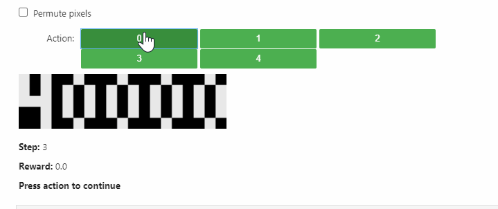
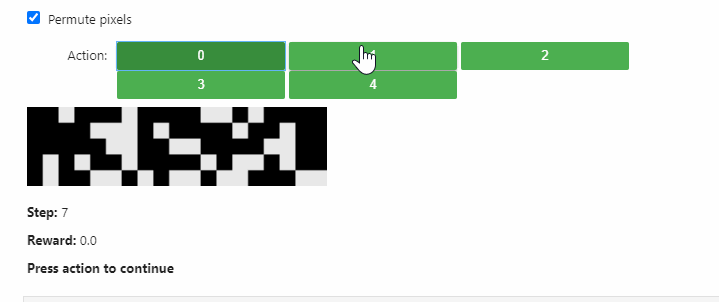

## Learning Interpretable Abstract Representations in Reinforcement Learning via Model Sparsity

The problem of learning good abstractions is arguably one of the cornerstones of Artificial Intelligence. One of the theoretical or philosophical approaches to learn abstract representations is the Consciousness Prior proposed by Yoshua Bengio. One of the key components in that project is the sparsity of the transition model, which supposedly leads to good learned abstractions. In this project, we design a simple environment where abstractions can be learned. We propose a practical framework for learning abstractions via sparsity of the transition model. The results show that we are able to recover the correct representation. We provide theoretical formulation of the problem and the explanation of the results. We provide exciting future research directions and concrete questions in the domain of learning good abstractions.

Talk for <a href="http://mlss.tuebingen.mpg.de/2020/">MLSS 2020</a>: 

Overall idea: 

Proposed architecture: 

Original causal graph (left) and optimized causal graph (right): 

Done as a semester project at Laboratory of Computational Neuroscience at the Swiss Federal Institute of Technology in Lausanne (EPFL)
<a href="https://www.overleaf.com/read/nqgjrjbcybrp">See full project report</a>

<a href="https://www.overleaf.com/read/mmmbrrvnkffq">Master thesis report draft</a>

We use [pytorch](https://pytorch.org/) to learn the sparse model and [stable baselines](https://stable-baselines.readthedocs.io/en/master/) for RL.

### Installation
1. You will need `conda` and `pip`
2. Install requirements: `pip install -r requirements.txt`
3. Install gin_tune: `pip install -e gin_tune`
3. Set up a MongoDB database `test` on port `27017` on local machine
4. Having ray installed, run `python ray/python/ray/setup-dev.py` to patch your ray installation
4. `pip install -e .`

### Performance of envs
1. `python -m causal_util.env_performance --env KeyChest-v0 --config keychest/config/5x5.gin` 
2. `python -m causal_util.env_performance --env CartPole-v0`
3. `python -m causal_util.env_performance --env VectorIncrement-v0 --config vectorincrement/config/ve5.gin`

### Learner
`python -m sparse_causal_model_learner_rl.learner --config $(pwd)/sparse_causal_model_learner_rl/configs/test_tune.gin --config $(pwd)/vectorincrement/config/ve5.gin`

### More images

Non-convex losses during training: 

Training feedback: 

Tensorboard integration: 

KeyChest environment: 

### Sanity checks
 

1. Can fit raw data on vectorincrement: `python learner.py --config ../vectorincrement/config/ve5.gin --config configs/test_fit.gin --config configs/single_sample.gin --nofail`
2. Can fit encoded data on vectorincrement: `python learner.py --config ../vectorincrement/config/ve5_linear.gin --config configs/test_fit.gin --config configs/single_sample.gin --nofail`
3. Can get the graph on vectorincrement 5x5 from data and value fcn reconstruction loss `python3 learner.py --config ../vectorincrement/config/ve5_linear.gin --config configs/vf_poc.gin --config configs/single_sample.gin --nofail`
4. Can get the graph on non-linear 5x5 -> 10x5 vectorincrement from data/vf rec loss `python3 learner.py --config ../vectorincrement/config/ve5_nonlinear.gin --config configs/vf_poc_nonlin.gin --config configs/single_sample.gin --nofail`

Gumbel model on ve5 (features raw):
`python -m sparse_causal_model_learner_rl.learner --config vectorincrement/config/ve5_nonlinear.gin --config sparse_causal_model_learner_rl/configs/rec_nonlin_gnn_gumbel
 --nofail --n_gpus 0 --n_cpus 1`
 
#### New modular config with ve2
1. Only features on vectorincrement (new config)
    `python -m sparse_causal_model_learner_rl.learner --config sparse_causal_model_learner_rl/configs/rl_const_sparsity_obs_space.gin --config sparse_causal_model_learner_rl/configs/env_ve2.gin --nofail --n_gpus 1`
   After ~25 minutes (~9000 steps) gives the following graph:
   
   
2. Features + reward + done
    `python -m sparse_causal_model_learner_rl.learner --nofail --n_gpus 1 --config sparse_causal_model_learner_rl/configs/rl_const_sparsity_obs_space.gin --config sparse_causal_model_learner_rl/configs/env_ve2_with_rew_done.gin`
   After ~2 hours (45k steps) gives the following graph:
   
   
3. No decoder/encoder:
    `python -m sparse_causal_model_learner_rl.learner --config sparse_causal_model_learner_rl/configs/rl_const_sparsity_obs_space.gin --config sparse_causal_model_learner_rl/configs/env_ve2_raw_with_rew_done.gin --nofail --n_gpus 1`
   After ~45 minutes gives:
   
   

#### KeyChest
1. PPO on KeyChest: `python sb.py --evaluate --train_steps 5000000 --config ../keychest/config/5x5.gin --trainer DQN`
2. DQN on KeyChest: `python sb.py --config ../keychest/config/5x5.gin --evaluate --train_steps 5000000 --train`

Success of DQN shows that the environment is Markov:

